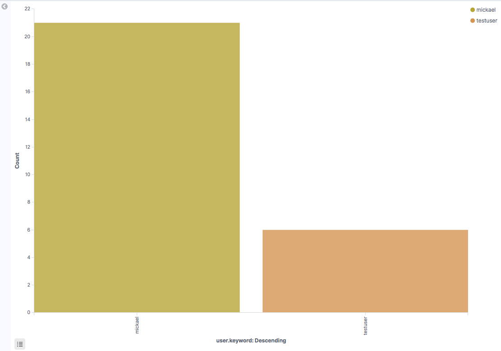
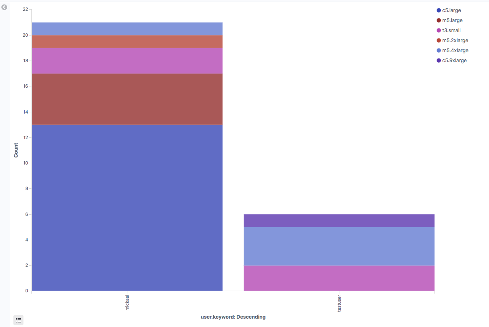
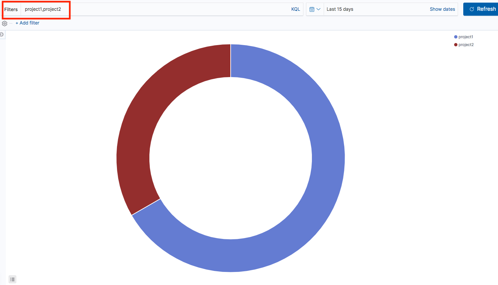
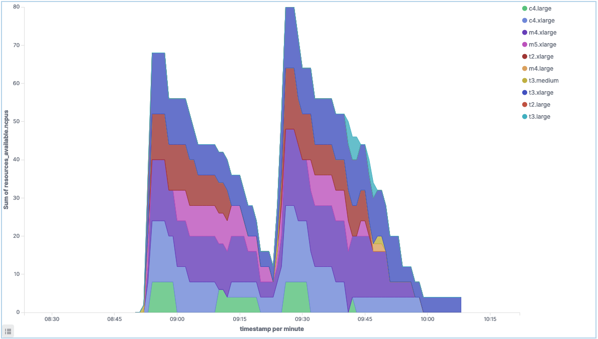
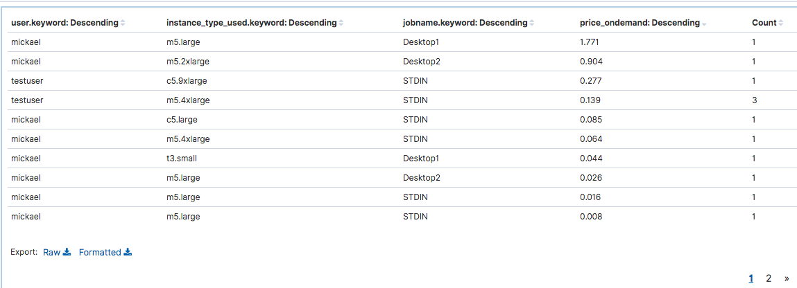
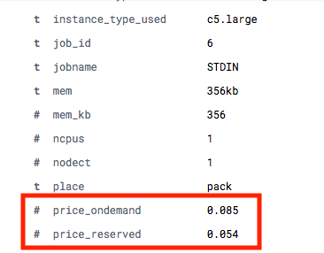

[On your Kibana cluster](../../analytics/monitor-cluster-activity/), click "Visualize" to create a new visualization. Below are some example to help you get started

*Note: For each dashboard, you can get detailed data at user, queue, job or project level by simply using the "Filters" section*

## Money spent by instance type

!!!example "Configuration"
    * Select "Vertical Bars" and "jobs" index
    * Y Axis (Metrics):
        * Aggregation: Sum
        * Field: price_ondemand
    * X Axis (Buckets):
        * Aggregation: Terms
        * Field: instance_type_used
        * Order By: metric: Sum of price_on_demand
    * Split Series (Buckets):
        * Sub Aggregation: Terms
        * Field: instance_type_used
        * Order By:  metric: Sum of price_on_demand

## Jobs per user 

!!!example "Configuration"
    * Select "Vertical Bars" and "jobs" index
    * Y Axis (Metrics):
        * Aggregation: count
    * X Axis (Buckets):
        * Aggregation: Terms
        * Field: user.keyword
        * Order By: metric: Count
    * Split Series (Buckets):
        * Sub Aggregation: Terms
        * Field: user.keyword
        * Order By: metric: Count
 
  

## Jobs per user split by instance type

!!!example "Configuration"
    * Select "Vertical Bars" and "jobs" index
    * Y Axis (Metrics):
        * Aggregation: count
    * X Axis (Buckets):
        * Aggregation: Terms
        * Field: user.keyword
        * Order By: metric: Count
    * Split Series (Buckets):
        * Sub Aggregation: Terms
        * Field: instance_type_used
        * Order By: metric: Count
 
  
    
## Most active projects 

!!!example "Configuration"
    * Select "Pie" and "jobs" index
    * Slice Size (Metrics):
        * Aggregation: Count
    * Split Slices (Buckets):
        * Aggregation: Terms
        * Field: project.keyword
        * Order By: metric: Count
    

If needed, you can filter by project name (note: this type of filtering can be applied to all type of dashboard)

## Instance type launched by user

!!!example "Configuration"
    * Select "Heat Map" and "jobs" index
    * Value (Metrics):
        * Aggregation: Count
    * Y Axis (Buckets):
        * Aggregation: Term
        * Field: instance_type_used
        * Order By: metric: Count
    * X Axis (Buckets):
        * Aggregation: Terms
        * Field: user
        * Order By: metric: Count

## Number of nodes in the cluster

!!!example "Configuration"
    * Select "Lines" and "pbsnodes" index
    * Y Axis (Metrics):
        * Aggregation: Unique Count
        * Field: Mom.keyword
    * X Axis (Buckets):
        * Aggregation: Date Histogram,
        * Field: timestamp
        * Interval: Minute

## Total number of CPUs by instance type

!!!example "Configuration"
    * Select "Area" and "pbsnodes" index
    * Y Axis (Metrics):
        * Aggregation: Sum
        * Field: resources_available.ncpus
    * X Axis (Buckets):
        * Aggregation: Date Histogram,
        * Field: timestamp
        * Interval: Auto
    * Split Series (Buckets):
        * Sub Aggregation: Terms
        * Field: resources_available.instance_type.keyword
        * Order By: metric: Sum

## Detailed information per user

!!!example "Configuration"
    * Select "Datatables" and "jobs" index
    * Metric (Metrics):
        * Aggregation: Count
    * Split Rows (Buckets):
        * Aggregation: Term
        * Field: user.keyword
        * Order By: metric: Count
    * Split Rows (Buckets):
        * Aggregation: Term
        * Field: instance_type_used.keyword
        * Order By: metric: Count
    * Split Rows (Buckets):
        * Aggregation: Term
        * Field: price_ondemand.keyword
        * Order By: metric: Count
    * Split Rows (Buckets):
        * Aggregation: Term
        * Field: job_name.keyword
        * Order By: metric: Count
    

## Find the price for a given simulation

Each job comes with `price_ondemand` and `price_reserved` attributes which are calculated based on: `number of nodes * ( simulation_hours * instance_hourly_rate ) `

