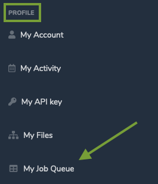

# Lab 4: Submit VCS Batch Jobs

This module provides instructions for running an example batch workload in the SOCA computing environment. The example workload is a CPU- and IO-intensive logic simulation that is found in integrated cicuit design workflows.

### Step 1: Submit jobs to the scheduler

Next, you'll submit four jobs into the cluster, each job requests a specific instance type. Using multiple instance types will help provide more interesting data to look at in the analytics lab.

1. Execute the run_tests.sh script by typing `./run_tests.sh` then hit enter. The script is broken into two sections: The first section creates 5 compute instances each with 4 vCPUs then the second section submits 20 batch jobs to these instances. You'll observe that the PBS scheduler will report the corresponding job ids for each of these 20 jobs. 

1. You can examine the run_tests.sh script by typing `cat run_tests.sh`. Notice that we're using Spot pricing model since the duration of these jobs are short. Also, notice that we're specifying `--terminate_when_idle 3` which would terminate the instances and remove them from the cluster 3 mins after all jobs running on the instances complete.

### Step 2: Watch job status

1. Run the `qstat` command to view the status of the jobs. You can also view job status in the web UI by clicking on **My Job Queue** in the left side navigation bar.
    

1. You can run the `pbsnodes -aSjL` command to see the EC2 instances that have joined the cluster. Initially, the nodes will be in **state-unknown,down** till they boot-up and join the queue.

    !!! note
        SOCA automation scripts are configured to monitor the status of the queues every minute. It typically takes 5-6 minutes to launch a new EC2 instance, boot the operating system, configure it to join the cluster, and have the assigned job to start running. 

### Step 3: Monitor test20 job

1. Monitor the status of test20 job by refreshing the **My Job Queue** page in SOCA portal and look for the **Status** column for the job with `test20` under **Name** column.

1. You can also monitor the status of the jobs in the terminal by typing `` watch -n 10 "qstat -u `whoami`" `` command which will keep monitoring the status of the jobs every 10 seconds. You'll need to wait for the **S** column represeting the status of the job correspoding to the one with **test20** under **Name** column. This job usually takes around 6 minutes to complete.

1. Once the job is in the running state (**S** column changes to **R** in the terminal or **Status** column changes to **RUNNING** on **My Job Queue** page in SOCA portal), look inside test20 directory for test.log and novas.fsdb by typing `ls test20/*`. Wait until test20/novas.fsdb is created as you'll need to use this fsdb file in the next lab.
 
In this lab you learned how to submit VCS batch jobs to the cluster and how to monitor the status of these jobs.

Click **Next** to move to the next lab.
