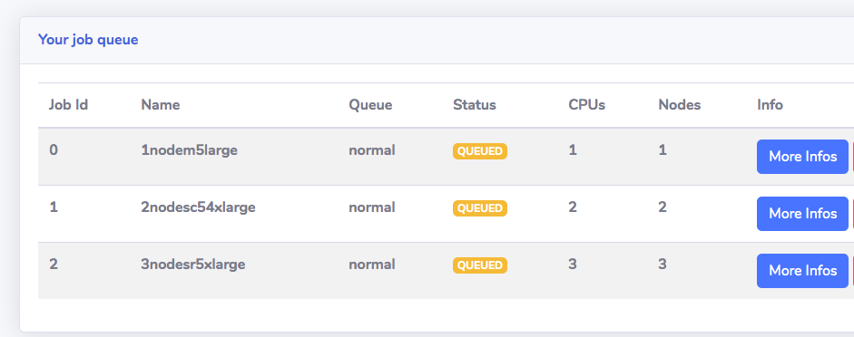

# Lab 5: Submit Batch Workloads

This module provides instructions for running an example batch workload in the computing envronment created the **Deploy environment** module. The example workload is a CPU- and IO-intensive logic simulation that is found in integrated cicuit design workflows.  The workload uses data contained in the public **AWS F1 FPGA Development Kit** and the **Xilinx Vivado** EDA software suite provided by the **AWS FPGA Developer AMI** that you subscribed to in the first tutorial. Although you'll be using data and tools from AWS FPGA developer resources, you will not be running on the F1 FPGA instance or executing any type of FPGA workload; we're simply running software simulations on EC2 compute instances using the design data, IP, and software that these kits provide for no additional charge.

### Step 1: Clone workload repo

1. Log into the DCV remote desktop session that you established **Launch Remote Desktop Session** lab.

1. Clone the example workload from the `aws-fpga-sa-demo` Github repo into your user's home directory on the NFS file system.

    ```bash
    cd $HOME
    git clone https://github.com/morrmt/aws-fpga-sa-demo.git
    ```

1. Change into the repo's workshop directory.

    `cd $HOME/aws-fpga-sa-demo/eda-workshop`

### Step 2: Submit jobs into the queue

Next, you'll submit four jobs into the cluster, each job requesting a specific instance type.  Using multiple instance types will help provide more interesting data to look at in the analytics lab.

1. **Submit jobs**. Submit each of the jobs below:

    `qsub -l instance_type=c5.xlarge -- $HOME/aws-fpga-sa-demo/eda-workshop/run-sim.sh --scratch-dir $HOME`

    `qsub -l instance_type=c4.xlarge -- $HOME/aws-fpga-sa-demo/eda-workshop/run-sim.sh --scratch-dir $HOME`

    `qsub -l instance_type=m5.xlarge -- $HOME/aws-fpga-sa-demo/eda-workshop/run-sim.sh --scratch-dir $HOME`

    `qsub -l instance_type=m4.xlarge -- $HOME/aws-fpga-sa-demo/eda-workshop/run-sim.sh --scratch-dir $HOME`

1. **Watch job status**. As soon as jobs are sent to the queue, the dispatcher script will start up a new compute instance to execute each job.  Run the `qstat` command to view the status of the jobs.  You can also view job status in the web UI by clicking on **My Job Queue** in the left side navigation bar.

    

You can also run the `pbsnodes -a` command to see the EC2 instances that have joined the cluster.

Click **Next** to move to the next section.