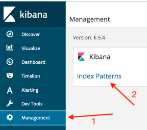
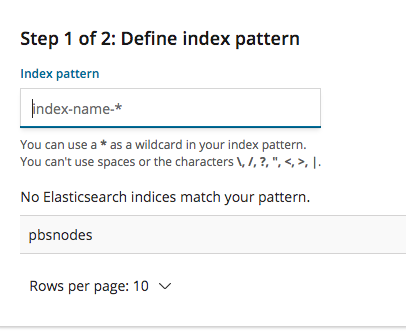
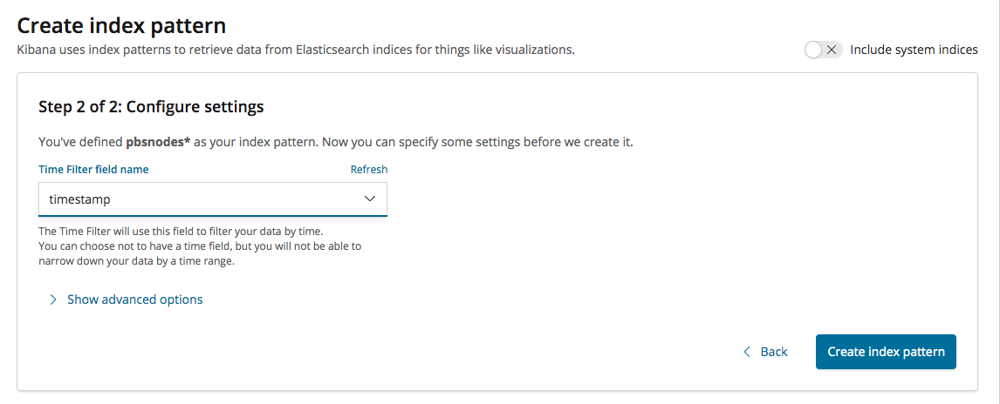
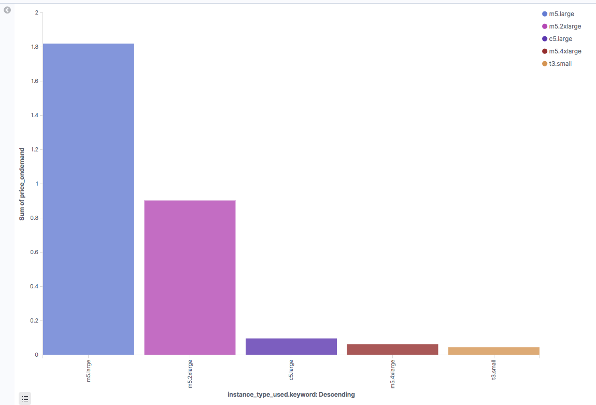
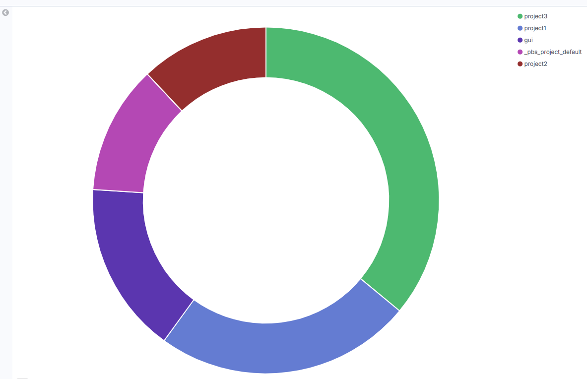
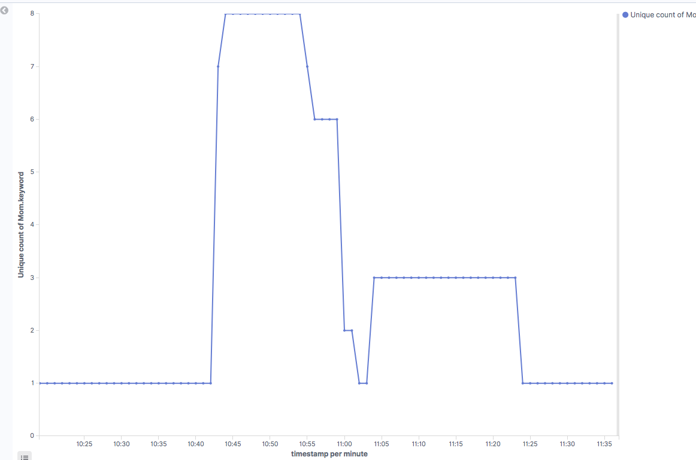

# Lab 6: Explore Analytics Dashboard


### Dashboard URL

Open your AWS console and navigate to CloudFormation. Select your parent Stack, click Output, and retrieve "WebUserInterface" 


### Add Data to your cluster


By default, Job information are ingested on an hourly basis. Run the command below on the **scheduler host** to trigger on-demand log ingestion into ElasticSearch:
```bash
source /etc/environment; /apps/python/latest/bin/python3 /apps/soca/cluster_analytics/job_tracking.py
```

### First Time Configuration

Since it's the first time you access this endpoint, you will need to configure your indexes.  
First, access Kibana URL and click "Explore on my Own"


Go under Management and Click Index Patterns



Select the Index you want to query



Click next, and then specify the Time Filter key (refer to section below for timestamp id). Once done, click Create Index Pattern<



Once your Index is configured, go to Kibana, select "Discover" tab to start visualizing the data


### Index Information


|  | Cluster Node Information | Job Information |
| ------------------------ | ----------- | ---------- | 
| Kibana Index Name       | pbsnodes         | jobs        | 
| Data ingestion       | /apps/soca/cluster_analytics/cluster_nodes_tracking.py         | /apps/soca/cluster_analytics/job_tracking.py        | 
| Recurrence     | 1 minute         | 1 hour **(note: job must be terminated to be shown on ElasticSearch)**       | 
| Data uploaded         | Host Info (status of provisioned host, lifecycle, memory, cpu etc ..)         | Job Info (allocated hardware, licenses, simulation cost, job owner, instance type ...)        | 
| Timestamp Key   | Use "timestamp" when you create the index for the first time         | use "start_iso" when you create the index for the first time        | 


____

### Examples


#### Cluster Node


#### Job Metadata


# Generate Graph


## Money spent by instance type

!!!example "Configuration"
    * Select "Vertical Bars" and "jobs" index
    * Y Axis (Metrics):
        * Aggregation: Sum
        * Field: price_ondemand
    * X Axis (Buckets):
        * Aggregation: Terms
        * Field: instance_type_used
        * Order By: metric: Sum of price_on_demand
    * Split Series (Buckets):
        * Sub Aggregation: Terms
        * Field: instance_type_used
        * Order By:  metric: Sum of price_on_demand





## Jobs per user split by instance type

!!!example "Configuration"
    * Select "Vertical Bars" and "jobs" index
    * Y Axis (Metrics):
        * Aggregation: count
    * X Axis (Buckets):
        * Aggregation: Terms
        * Field: user.keyword
        * Order By: metric: Count
    * Split Series (Buckets):
        * Sub Aggregation: Terms
        * Field: instance_type_used
        * Order By: metric: Count
 
  
    
## Most active projects 

!!!example "Configuration"
    * Select "Pie" and "jobs" index
    * Slice Size (Metrics):
        * Aggregation: Count
    * Split Slices (Buckets):
        * Aggregation: Terms
        * Field: project.keyword
        * Order By: metric: Count
    




## Instance type launched by user

!!!example "Configuration"
    * Select "Heat Map" and "jobs" index
    * Value (Metrics):
        * Aggregation: Count
    * Y Axis (Buckets):
        * Aggregation: Term
        * Field: instance_type_used
        * Order By: metric: Count
    * X Axis (Buckets):
        * Aggregation: Terms
        * Field: user
        * Order By: metric: Count


## Number of nodes in the cluster

!!!example "Configuration"
    * Select "Lines" and "pbsnodes" index
    * Y Axis (Metrics):
        * Aggregation: Unique Count
        * Field: Mom.keyword
    * X Axis (Buckets):
        * Aggregation: Date Histogram,
        * Field: timestamp
        * Interval: Minute




## Find the price for a given simulation

Each job comes with `estimated_price_ondemand` and `estimated_price_reserved` attributes which are calculated based on: `number of nodes * ( simulation_hours * instance_hourly_rate ) `


### Troubleshooting access permission

Access to ElasticSearch is restricted to the IP you have specified during the installation. If your IP change for any reason, you won't be able to access the analytics dashboard and will get the following error message:
~~~json
{"Message":"User: anonymous is not authorized to perform: es:ESHttpGet"}
~~~

To solve this issue, log in to AWS Console  and go to ElasticSearch Service dashboard. Select  your ElasticSearch cluster and click "Modify Access Policy"


Finally, simply add your new IP under the "Condition" block, then click Submit


Please note it may take up to 5 minutes for your IP to be whitelisted
